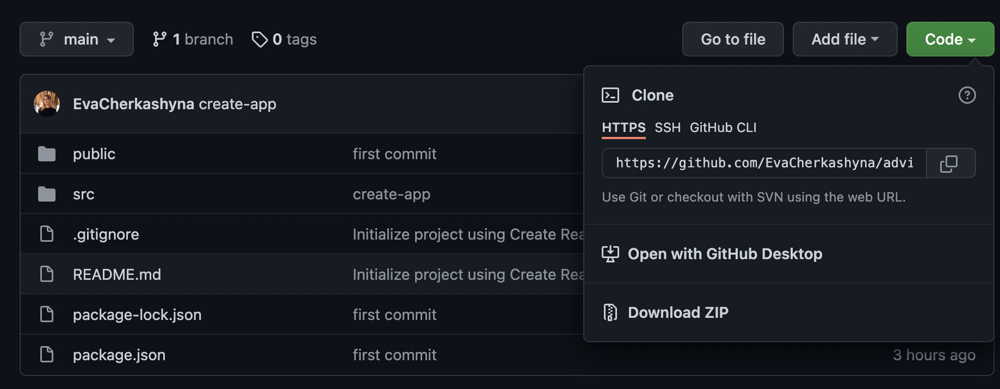

# Advice Generator

This application generates advices.

# View next advice

Click on the green button to view the next advice.

# How to copy advice

Click on the two horizontal bars and the advice will be copied to the clipboard.

# Demo

You can see my demo : [DEMO](https://evacherkashyna.github.io/advice-generator-app/).

# Download instructions

1. Copy the link you can find by clicking on the green `code` button .
2. In the terminal: `git clone link`.
3. The project will be copied to the selected folder.